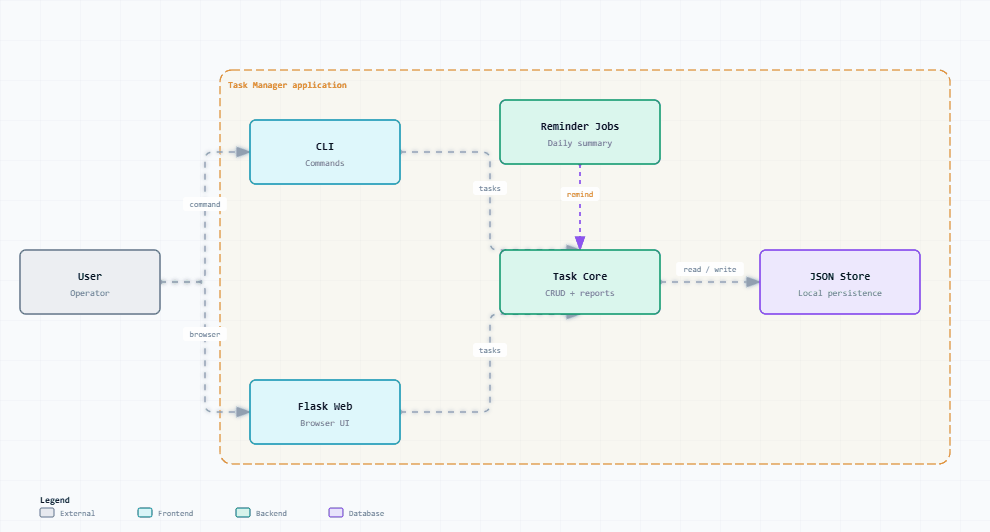

# Task Manager

Task Manager 是一个个人任务管理系统，提供命令行和 Web 两种使用方式，适合记录任务、搜索过滤、统计复盘和查看提醒。

## 功能概览

- 任务创建、查看、更新、删除
- 按状态、优先级、标签过滤
- 关键词搜索
- 统计报表
- 周报生成
- 任务提醒
- 每日摘要
- Web 页面管理
- 单元测试覆盖核心模块

## 技术栈

- Python
- Flask
- JSON 本地存储
- pytest

## 项目结构

```text
task-Manager/
├── task-manager/   # 主应用
└── dev-plans/      # 开发计划文档
```

## 本地启动

```bash
cd task-manager
pip install -r requirements.txt
```

### 命令行

```bash
python main.py list-tasks
python main.py create-task "学习 Python"
```

### Web 界面

```bash
python web_app.py
```

访问：

```text
http://localhost:5000
```

### 主题模式

打开 `/settings/` 可以选择跟随系统、浅色或深色模式，并选择默认、玫瑰、海洋或薄荷强调色。设置会保存在当前浏览器的 `localStorage` 中；页面右上角的“主题模式”按钮可快速循环切换三种模式。跟随系统模式会响应操作系统的浅色/深色偏好变化。

## 测试

```bash
python -m pytest tests/ -v
```

## 仓库

```text
https://github.com/liuGuanYi-hub/task-manager
```

## 动态系统架构图



- [打开交互式动态架构图](docs/architecture/dynamic-archify-architecture.html)
- [查看架构源数据](docs/architecture/dynamic-archify-architecture.json)
